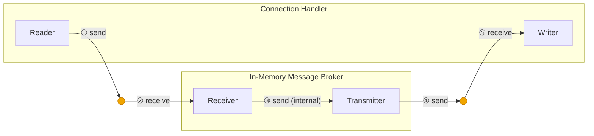

## Goals:
- no panics in the broker or in the websocket handlers

## Notes:
- sending to a tokio::sync::mpsc channel will block if the channel is full
- sending to a tokio::sync::mpsc channel will error if the receiver has been closed
    - the receiver can be closed either explicitly or by going out of scope
- receiving (recv) on a tokio::sync::mpsc channel receiver will block if the channel is empty
- receiving (recv) on a tokio::sync::mpsc channel receiver will return the None variant of the Option enum if all of the senders have been closed for that channel

## Technical Requirements:

- locations of failures in the flow:
    1. sending messages from a websocket handler (read) to the broker
        - Error
            - this indicates that the broker receiver has been dropped, this can only mean that the broker is no longer working
            - [ ] drop the websocket connection
                - [ ] deregister the connection with the broker
                - let the transmitter and receiver go out of scope
                - [ ] send a closing frame
                - [ ] stop the writer task
                    - [ ] use a oneshot channel from the reader task to the writer task to indicate that the writer task should send a closing frame and then drop
                        - use tokio::select to read from one of two channels in the writer task, either the receiver from the broker or the oneshot channel from the reader
        - Blocking wait
            - this indicates that the broker receiver cannot process messages fast enough to keep up with the number of connections that are sending messages
            - wait synchronously until the broker can catch up with the new messages
            - is the websocket receiver unbounded?
    2. receiving messages at the broker level
        - None variant
            - this indicates that all of the transmitters have been dropped, this should not happen
            - [x] return from the run broker task
    3. We can skip this because there is no channel here, just a for loop
    4. Sending from the broker to a websocket handler (write)
        - use try send
            - Error disconnected
                - this would indicate that the task receiving messages from the broker and sending websocket messages has panicked
                - [ ] delete that connection from the mapping
                - probably delete the dropped connections from the mapping all at once after iterating through the map of all the connections
            - Error full buffer
                - we don't want slow consumers to hinder fast consumers and fast producers
                - could this eventually lead to metastable failure?
                - [ ] drop the message for that connection
    5. Receiving messages from the broker
        - None variant
            - this indicates that the transmitter for this connection has already been dropped or closed
            - the broker is no longer tracking this connection
            - [ ] drop this websocket connection:
                - [ ] deregister the connection from the broker
                - [ ] send a closing frame
                - [ ] stop the receiver task
- calls to deregister for connection ids that are not in the connections map should not produce a panic in the broker task
- is it possible to know at compile time that the broker struct thread cannot panic?

## Resources:
- channel documentation:
    - https://docs.rs/tokio/latest/tokio/sync/mpsc/fn.channel.html
- sender documentation:
    - https://docs.rs/tokio/latest/tokio/sync/mpsc/struct.Sender.html
- receiver documentation:
    - https://docs.rs/tokio/latest/tokio/sync/mpsc/struct.Receiver.html