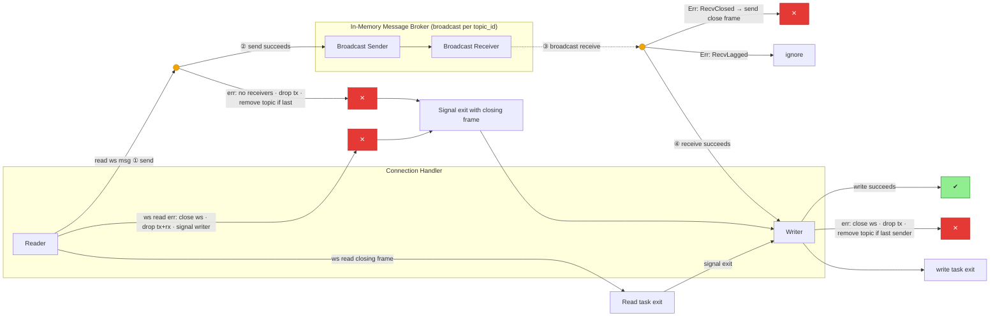

## Task
- The message proxy task currently uses a multiple producer single consumer channel to send messages from websocket readers to the broker
    - websocket readers are not partitioned into separate topics
- update the broker implementation such that a connection is part of a topic
    - connections should only get the messages associated with that topic
    - connections should not get messages that they have written to the topic
- connections can only be part of one topic
- adding and removing members from partitions should be explicit
- slow readers from one topic should not slow down other topics
- many messages or many receivers for one topic should not block the sending or receiving of messages for other topics

## New Broker api:
- old broker api:
```rust
impl<M: Routable + Clone> Broker<M> {
    /// method that can be used to register a new connection with the 
    /// broker. This takes a connection id and returns a mp transmitter that 
    /// the handler can use to send messages and a sp receiver that the handler
    /// can use to receive messages from the broker
    pub fn register(&self, connection_id: M::Key) -> (Sender<M>, Receiver<M>) {
```
- new broker api:
```rust
pub fn register(&self, connection_id: M::Key, topic_id: M::Key) -> (Sender<M>, Receiver<M>) {
```
- in this case the connection just has to know its connection id, not its topic id when it is constructing messages to send
- internally the broker should keep a collection of many senders, one for each topic
    - when a client comes with a new topic_id, the broker should create a new sender and receiver for that topic id that can be used to send messages from read tasks to the broker
    - then for each read task the broker should create a Sender and Receiver
- when the last client for a topic is deregistered then we should delete the broker receiver for that topic id
- broker internal data structures:
    - topics\[topic_id: String, tx_topic: Sender\]
    - connections
        - map[topic_id]map[connection_id]sender

## Second Approach:
- use tokio async broadcast
    - the broker internally keeps a mapping between topic id and pairs of (sender, receiver)
        - store just a weak sender in the mapping so that we can call the weak sender to see how many receivers are associated with it
    - clients are responsible for choosing if they want to filter out messages that they published to the broker
    - when adding or removing connections from a topic we can cleanup senders for which there are no longer any receivers
- need an explicit way to know when there are no longer any clients in a topic partition
    - if we have many dead topics in the hashmap, we could eventually run out of memory
    - readers lag behind writers. this means that messages are maintained in the channel while there are still receivers that have not read them (up to the capacity of the channel)
    - we should allow new connections to a topic while there are still open receivers for that topic_id, even if all the websocket readers / broker senders have already quit
    - whether or not a channel is closed is not of importance to us
        - a channel is closed when there are no strong senders open for that channel
    - we only care if there are receivers for that channel, this is what determines the liveness of the channel
        - receivers with no senders can still receive messages until the channel is empty
        - senders with no receivers can not send messages at all
    - implement topic_id cleanup logic in the drop trait of the receiver portion of the subscription
        - if a receiver is the last receiver according to the receiver count, then we can remove that topic_id from the topics mapping
    - wrap just the receiver that we send to each websocket connection, not the sender
- consumers should pull as many messages as they can from the queue and send them in large batches instead of reading messages one at a time
    - consumers can merge many messages from the broker into few websocket messages
    - this helps avoid the problem of slow consumers lagging behind fast producers
        - reduce the amount of time between calls to .recv by batching
        - don't pay the cost of sending a websocket message between reading each message
    - batch receive with try receive in a loop


- [x] handle errors 
    1. reading from the websocket receiver
        - [x] close the websocket connection
        - [x] drop the sender and receiver for this connection
        - [x] indicate to the writer websocket handler that we should send a closing frame and drop the websocket connection
    2. sending to the broker sender
        - this indicates that there are no live receivers for this topic_id
        - this can only happen if the websocket write handler fails and we receive messages to write to the broker for this websocket connection before we receive the oneshot channel message saying that the websocket write handler failed
            - [x] drop the sender for this client
                - [x] if this is the last sender for this client, remove the topic_id from the map
            - the write websocket handler must have already failed in order for this to happen so we don't have to worry about dropping the write handler or sending a closing frame
    3. receiving from the broker receiver
        - error RecvClosed
            - this means that there are no open senders for the topic currently
            - [x] send a closing frame then close the websocket connection
        - error RecvLagged
            - ignore
    4. sending to the websocket receiver
        - [x] close the websocket connection
        - [x] drop the sender for this client
            - [x] if this is the last sender for this client, remove the topic_id from the map
                - count the number of active senders only, not the number of active receivers
                - this is because
- [x] update the broker so that it uses broadcast
    - ensure that the last receiver for a topic being dropped means that the topic is removed from the topics hashmap
- [x] update the handlers so that they take a topic_id

## Diagram


## Thoughts on Persistence and the broker:
- messages should be persistent before they are sent to the broker
    - the broker is only responsible for sending messages between websocket connection tasks, it is not responsible for business logic or persistence