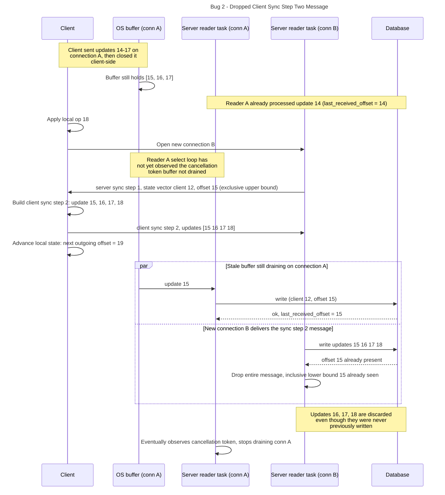

## Bug 1:
### Description:
- before making this change update messages were identified by their __inclusive__ lower bound of offsets in the update
- when constructing a server sync step one message, we were using the __inclusive__ upper bound of operation offsets received by the server from this client to construct the state vector. The state vector contained the offset of the most recent operation received by the server
    - example: { 12: 4 } indicates that the server has received up to operation 4
- this state vector was used to create a bulk update / client sync step two message on the client
    - yrs treats state vectors as containing the __exclusive__ upper bound, or the next operation that the server expects to receive
    - yrs created a bulk update message including one redundant operation and all operations for this client id following that operation
    - example: [ (update 12, 4), (update 12, 5), (update 12, 6)] contains updates starting at the value in the state vector onward
- this client sync step two message was then sent to the server
- the server drops the client sync step two message because it has the same offset at the previous message received for that client
    - the server determines the offset from the lower 
    - example: (new_offset 4) < (last_received_offset 4) so we drop the update even though it includes operations [4, 5, 6]
- the client transitions it's internal state such that it now starts sending update messages at the offset after the highest offset in the client sync step two message
    - example: [ (update 12, 7) ]

### Effect:
- even though an update message with operations at offsets 5 and 6 was sent to the server, the server dropped that update
- the client sent an update message with more than the necessary operations in it
### Solution:
- update the server sync step one code to create a state vector that includes the __exclusive__ upper bound of operations that have been received for a client
    - this prevents the client from sending extra operations 
    - this also prevents the server from dropping the message in this case only (more on this later)

## Bug 2: Dropped Client Sync Step Two Message
- before fixing this bug we used the inclusive lower bound to assign an offset to each update. This offset uniquely identifies the update message as part of the tuple (topic_id, client_id, offset)
- before making this change, the server code would non-deterministically select from the cancellation token indicating that the websocket has been closed and reading from the incoming websocket buffer
- update messages from a websocket connection are processed in serial and under heavy load it may take up to 2 seconds to acquire a postgres database connection
- for all these reasons, there exists a scenario in which there may be one websocket connection open for a client id but two different read tasks open, with the first of the two being associated with a closed websocket connection but a full buffer of websocket messages
- assume a client has send a number of update messages on websocket connection A and the closed the connection from the client side
    - at this point there are some messages in the os tcp connection buffer for connection A
    - example: sent operations: [(update 12, 14), (update 12, 15), (update 12, 16), (update 12, 17)] 
- an operation is applied locally on the client
    - example (update 12, 18)
- the client then reconnects to websocket connection B
    - assume this happens before the server has the opportunity to drain the incoming buffer of websocket messages for connection A and by some random change of scheduling, checking the cancellation token has not been scheduled in the select statement for the read task yet
    - example: messages still in the buffer: [(update 12, 15), (update 12, 16), (update 12, 17)] with the last received offset being 14 for client 12
- the server sends a server sync step one message to the client on websocket connection B with the last seen message in the state vector. This server sync step one message includes the exclusive upper bound of offsets of operations that have been received for this client
    - example: { 12: 15 } this indicates that the server has received operation 14 and is expecting operation 15
- the client receives the server sync step one message and constructs a client sync step two message including all operations following the offset in the state vector and including the offset in the sate vector. This message is sent on websocket connection B
    - example: [(update 12, 15), (update 12, 16), (update 12, 17), (update 12, 18)]
- the client then updates its internal state so it can start sending update messages on websocket connection B
    - example: (update 12, 19) sent by the client
- the server then reads an update from websocket connection A and applies that update. This may claim the offset that the client is going to send a client sync step two message with as the inclusive lower bound
    - example: (update 12, 15) applied by the server, claiming offset 15
- the server then reads the client sync step two message from connection B and drops that update because it has the same inclusive lower bound offset as the most recent operation read from websocket connection A
    - this happens even though the client sync step two message has a higher inclusive upper bound than the most recently received update
- at this point the reader task associated with websocket connection A will probably check the cancellation token before draining the websocket buffer further

### Effect:
- operations that were performed locally on the client after the websocket connection A was dropped or operations that were still in the os buffer for websocket connection A are lost writes

### Solution:
- update the server code processing client sync step two messages or client update message to parse the offset of the message as the inclusive __upper__ bound of operations in that message for that client instead of the inclusive __lower__ bound of operations for that client
- also update the server code to use first-write wins semantics when writing update messages to the operations table with the same (topic_id, client_id, offset) primary key

### Why does this work, Proof by induction:
- if the update with the inclusive upper bound 0th offset is written to the database, dropping another operation for that topic_id, client_id pair with the 0th offset does not result in lost writes
- if there exists an operation in the database with the inclusive upper bound 1st offset, dropping an update message with the 1st offset will not result in dropped data, even if that update message includes operations with offset 0 and 1
    - this is because all operations for a websocket connection are processed sequentially
    - in order for the 1st offset to be in the database, the 0th offset must also be in the database
- therefore for all n, if the nth operation is already in the database, dropping an update message with the upper bound of n will not result in lost data

